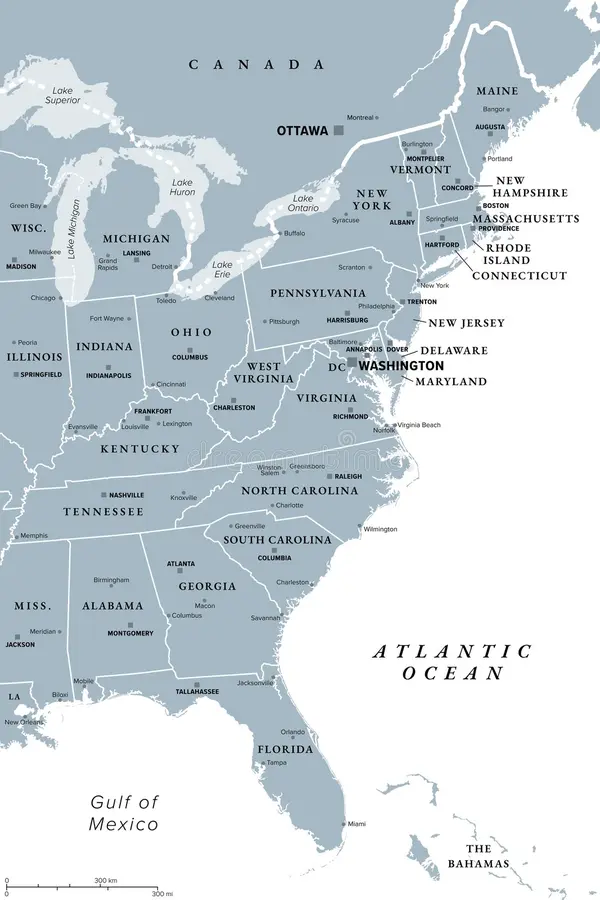
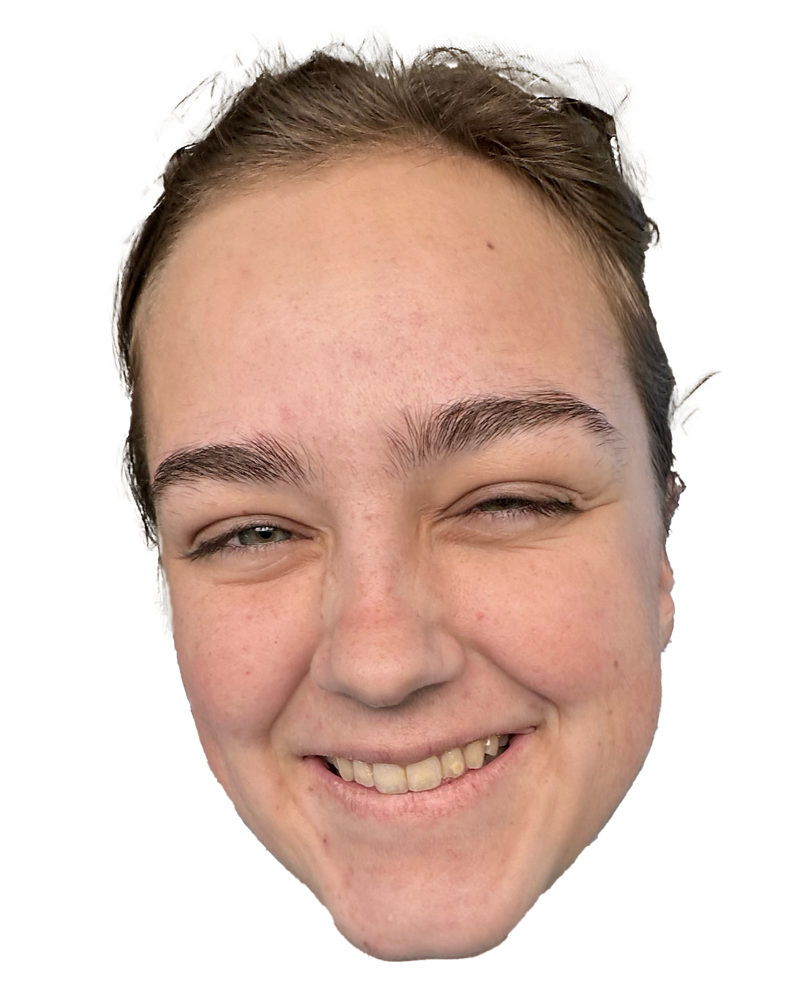

# Guess-Where-I-Moved
Drag and drop me to the place you think I moved
<!DOCTYPE html>
<html lang="en">
<head>
  <meta charset="UTF-8" />
  <meta name="viewport" content="width=device-width, initial-scale=1" />
  <title>Guess Where I Moved!</title>
  <link rel="stylesheet" href="style.css" />
</head>
<body>
  <h1>Guess Where I Moved!</h1>
  
Drag the marker onto the correct state.

  

    
    
  

  

  
</body>
</html>
body {
  font-family: Arial, sans-serif;
  max-width: 600px;
  margin: 2em auto;
  text-align: center;
}

#game-container {
  position: relative;
  display: inline-block;
}

#map {
  max-width: 100%;
  display: block;
}

#marker {
  position: absolute;
  top: 10px;
  left: 10px;
  width: 40px;
  cursor: grab;
  user-select: none;
  z-index: 10;
}
const marker = document.getElementById('marker');
const map = document.getElementById('map');
const result = document.getElementById('result');

// Correct drop zone (example coordinates on the map)
const correctArea = {
  x: 200,  // X coordinate on the image
  y: 150,  // Y coordinate on the image
  radius: 50 // radius for "correct" drop area
};

marker.addEventListener('dragstart', (e) => {
  e.dataTransfer.setData('text/plain', 'marker');
});

map.addEventListener('dragover', (e) => {
  e.preventDefault();
});

map.addEventListener('drop', (e) => {
  e.preventDefault();

  // Calculate drop position relative to image
  const rect = map.getBoundingClientRect();
  const x = e.clientX - rect.left;
  const y = e.clientY - rect.top;

  // Move marker to drop position
  marker.style.left = x - marker.width / 2 + 'px';
  marker.style.top = y - marker.height / 2 + 'px';

  // Check if dropped near correct area
  const dx = x - correctArea.x;
  const dy = y - correctArea.y;
  const dist = Math.sqrt(dx * dx + dy * dy);

  if (dist <= correctArea.radius) {
    result.textContent = "🎉 You guessed it! I moved here!";
    result.style.color = 'green';
  } else {
    result.textContent = "❌ Nope, try again!";
    result.style.color = 'red';
  }
});
